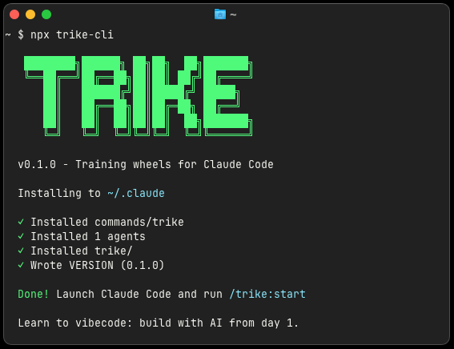
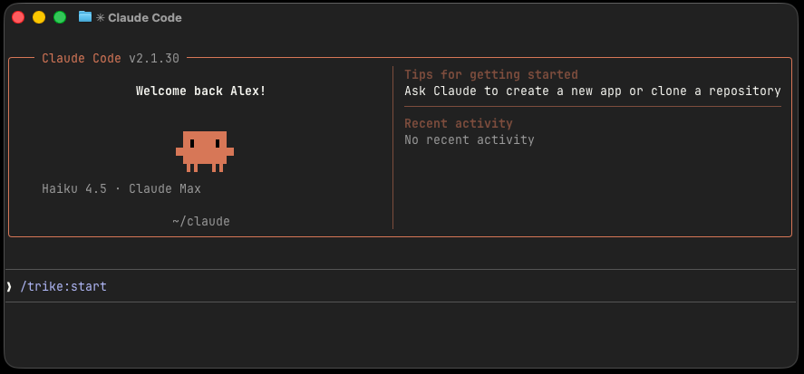

<div align="center">

# TRIKE CLI


**Your training wheels for [Claude Code](https://claude.ai/code)**

A light-weight Claude Code plugin that helps experienced developers new to AI development tools transition to agentic coding through a personalized, hands-on learning path built around their own codebase

<br>
<br>

```bash
npx trike-cli
```

<!-- <br> -->



</div>

---

## What is Trike?

Claude Code's ecosystem has grown fast - slash commands, context management, skills, MCPs, hooks, subagents, and more. For experienced developers who haven't made the jump yet - whether it's lack of time, too much noise around AI coding, or a bad past experience with other tools - committing to learn all of it in isolation is a big ask.

Trike takes a different approach. Instead of sandboxes or sample projects, it teaches you Claude Code inside your own codebase:

- **Personalized plan** — Trike assesses your experience level, analyzes your project, and builds a learning path matched to your goals and tech stack
- **Learn by doing** — Guided milestones walk you through each tool and give you concrete tasks to apply it right in your codebase
- **Ship hands-free** — As a final challenge, you build a real feature in your project without writing a single line of code yourself
- **Always there** — After you're done learning, Trike stays in your setup as a quiet utility you can call on whenever you need it

## Getting Started

### 1. Install Claude Code (if you haven't already)

```bash
# macOS / Linux
curl -fsSL https://claude.ai/install.sh | bash

# Windows (PowerShell)
irm https://claude.ai/install.ps1 | iex
```

Verify it's working:
```bash
claude --version
```

> Need help? See the [official setup guide](https://code.claude.com/docs/en/setup).

### 2. Install Trike

```bash
npx trike-cli
```

Trike installs itself as a Claude Code plugin — no extra config needed.

### 3. Start learning



Open Claude Code in any project directory and run:

```bash
/trike:start
```

## How It Works

**1. Assessment** - Answer 8 questions about your Claude Code knowledge (2 min)

**2. Project Analysis** - Trike analyzes your actual project's tech stack and structure (1 min)

**3. Personalized Path** - Get a custom learning curriculum focused on what YOU need (instant)

**4. Learn by Doing** - Work through milestones, each teaching a Claude Code feature in the context of YOUR project (2-3 hours)

**5. Fully Optimized** - Leave with:
- CLAUDE.md configured for your tech stack
- .claudeignore optimized
- Recommended skills installed
- Recommended MCPs configured
- Complete understanding of all Claude Code features

## Commands

Once installed, you have access to these commands in Claude Code:

- `/trike:start` - Begin your learning journey
- `/trike:quiz` - Take the knowledge assessment
- `/trike:begin` - Analyze your project and create curriculum
- `/trike:next` - Get the next milestone in your learning path
- `/trike:progress` - Check your current progress

**Utility commands** (available after completion):
- `/trike:setup-check` - Audit any project's Claude Code setup
- `/trike:prompt-help` - Get help improving your prompts

## What You'll Learn

Depending on your assessment results, your learning path may include:

### Core Features
- How to use slash commands effectively (`/memory`, `/rewind`, `/review`, `/agents`, etc)
- Understanding how context works and token management
- Creating effective CLAUDE.md files for your tech stack
- Optimizing .claudeignore for your project structure

### Power Features
- Installing and using Skills (specialized knowledge modules)
- Setting up MCP servers (tool integrations)
- Configuring hooks for workflow automation

### Advanced Features
- When and how to use extended thinking
- Working with subagents for parallel tasks
- Checkpointing and session management strategies

**Every topic is taught by applying it to YOUR real project** - no abstract tutorials or toy examples.

## Contributing

We welcome contributions! Please see [CONTRIBUTING.md](CONTRIBUTING.md) for guidelines.

## License

MIT © [Alex Levadski](https://github.com/alevadski)

---

<div align="center">

**Built for developers, by developers.**

[Report Bug](https://github.com/alevadski/trike/issues) · [Request Feature](https://github.com/alevadski/trike/issues)

</div>
